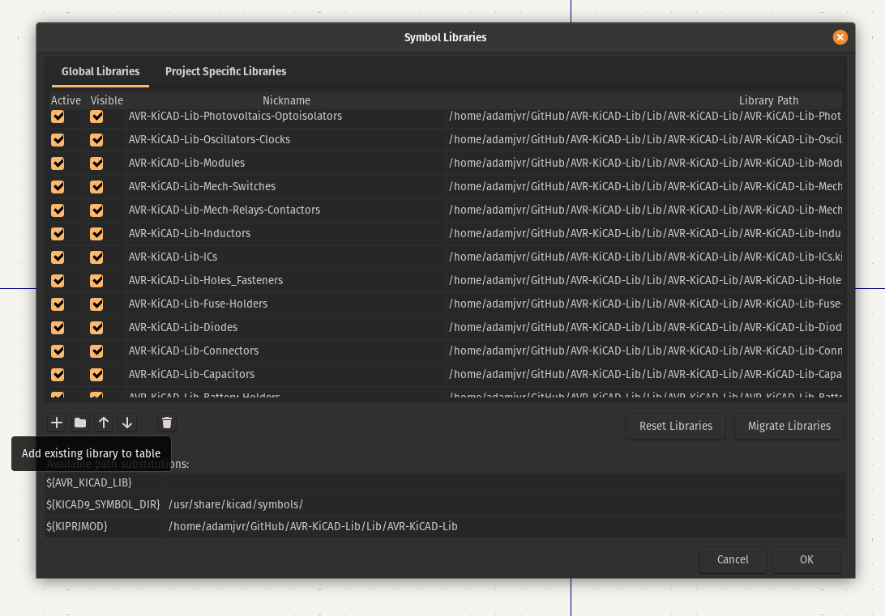
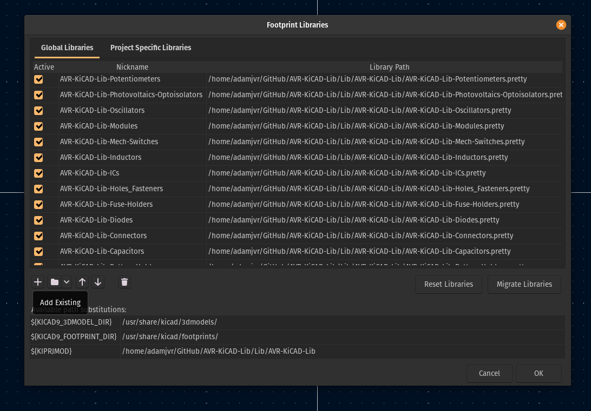

# AVR-KiCAD-Lib

An open-source library for KiCAD containing footprints and schematic symbols for all the components I use in my personal designs. This library is designed to share my personal collection of footprints and symbols so that they can be reused and extended by the open source community but also as a live example of how to employ the AVR-Method.

## Features

- **Comprehensive Component Selection**: Includes symbols and footprints for a wide range of AVR microcontrollers.
- **IPC-Compliant Footprints**: Footprints are created with best practices in mind to ensure compatibility and ease of manufacturing.
- **Open-Source and Community-Driven**: Free to use, modify, and distribute. Contributions are welcome!
- **AVR-Method Compliant**: This library follows the AVR-Method for KiCAD library creation and management, ensuring a consistent and well-structured approach.

## Installation

To use this library in your KiCAD projects, follow these steps:

### Clone or Download the Repository
Navigate to your preferred git cloning directory (e.g., `~/Github`) and clone the repository:

    git clone https://github.com/adamjvr/AVR-KiCAD-Lib.git

Alternatively, you can download the repository as a ZIP file and extract it.

### Add the Schematic Library to KiCAD

Open KiCAD and go to Preferences > Manage Schematic Libraries...

Click the + button in the Library Manager to add a new library.

Navigate to the symbols folder inside the cloned repository and select the AVR-KiCAD-Lib.lib file.

Give it a name like AVR-KiCAD-Lib and save it as a project or global library.

### Add the Footprint Library to KiCAD

Open KiCAD and go to Preferences > Manage Footprint Libraries...

Click the + button to add a new library.

Navigate to the footprints folder inside the cloned repository and select the AVR-KiCAD-Lib.pretty folder.

Give it a name like AVR-KiCAD-Lib.pretty and save it as a project or global library.

## Usage

Once the library is installed, you can access the components from within the KiCAD project editor.

**Schematic Editor**: Use the Add Symbol tool (shortcut `A`) and search for `AVR-KiCAD-Lib` to find all the available schematic symbols.

**PCB Layout Editor**: When assigning footprints, the `AVR-KiCAD-Lib.pretty` library will be available for you to select footprints.

## Contribution

Contributions are welcome and highly appreciated! If you find a bug or want to add a new component, please follow these steps:

1. Fork the repository.
2. Create a new branch for your feature or bug fix.
3. Make your changes and ensure they adhere to KiCAD's library conventions.
4. Submit a pull request with a clear description of your changes.

## License

This library is licensed under the CERN Open Hardware Licence Strongly Reciprocal v2.  
See the LICENSE

## Credits

Created by adamjvr.
